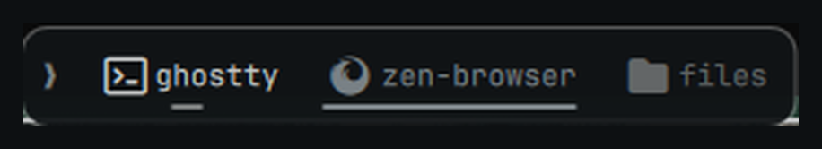

# OmaDock

A fast, terminal-inspired application dock for Omarchy Quattro.

OmaDock is a native Quickshell overlay for Hyprland. It helps you launch,
focus, and cycle through applications while staying out of the way when it is
not needed. Think of it as a small graphical command strip—with fewer commands
to remember.

> The dock hides so your windows can shine. Mostly.



## Features

- Smart Hide with edge reveal and Hyprland-aware window detection.
- Independent behavior on each monitor.
- Pinned applications and running, unpinned applications.
- Launch, focus, multi-window cycling, and safe context-menu actions.
- Drag reorder for pinned apps, including pinning eligible running apps.
- A bar widget with a preferences panel for hiding, layout, and pointer actions.
- Dot-matrix glyphs resolved from the application, its name, or its desktop
  entry categories.
- Live Omarchy theme integration.
- A JSON configuration file that survives updates and removal.
- No daemon, polling loop, telemetry, network requests, or extra runtime.

OmaDock is not a replacement for the Omarchy bar, a standalone desktop shell,
or a macOS dock cosplay contest.

## Requirements

- Omarchy Quattro
- Hyprland
- Quickshell `0.3.x`
- The official `omarchy plugin` command

The first release targets the Omarchy `4.0.1-1` / Quickshell `0.3.1`
baseline.

Multi-monitor support is implemented — each monitor keeps its own hide state, and
`monitorMode` selects `all`, `focused`, or a named list — but it has so far only
been exercised on a single display. Reports from multi-monitor setups are
welcome.

## Installation

### Omarchy plugin

The recommended installation method:

```bash
omarchy plugin add https://github.com/matheusmedrado/omadock.git --enable
```

### Manual Git installation

For a regular local checkout:

```bash
git clone https://github.com/matheusmedrado/omadock.git \
  ~/.config/omarchy/plugins/io.github.matheusmedrado.omadock
omarchy-shell shell rescanPlugins
omarchy plugin enable io.github.matheusmedrado.omadock
```

OmaDock runs inside the existing Omarchy shell. It does not install a separate
process or edit Hyprland configuration.

## Usage

The dock sits at the bottom edge of each enabled monitor and uses Smart Hide by
default:

- **Left click:** launch, focus, or cycle an application's windows.
- **Middle click:** launch a new instance.
- **Mouse wheel:** cycle existing windows.
- **Right click:** open actions such as pin, unpin, or close the active window.
- **Drag:** reorder pinned apps, or drag a running app into the pinned region.
- **Drag out:** pull a pinned app clear of the strip to unpin it. A running
  application stays in the dock as an unpinned entry until it exits.
- **Edge hover:** reveal the dock when Smart Hide has tucked it away.

With **Reserve space** switched on, a revealed dock pushes windows up instead of
covering them, and they flow back the moment it hides. Under Smart Hide that
makes any tiled window count as a reason to hide, because releasing the space is
exactly what would put a window back under the dock; floating windows are exempt,
since an exclusive zone never moves them.

Activating a window on another workspace lets Hyprland handle the workspace
change; OmaDock does not move the pointer for you.

The dock suspends itself on fullscreen workspaces by default, because games and
videos deserve the whole screen—and all the pixels they can get.

## Preferences

OmaDock ships a bar widget. Its icon is the dock's own dot-matrix glyph; click it
to open a preferences panel covering hiding, layout, glyphs, and pointer actions.
Middle-clicking the icon toggles between Smart Hide and never hiding, which is
the setting worth reaching for without opening anything.

Add it to the bar from the Omarchy plugin UI, or from a terminal:

```bash
omarchy-shell shell putBarWidget io.github.matheusmedrado.omadock '{"section":"right"}'
```

The panel writes to the same `config.json` described below, through the same
validation, so a change made there is identical to one typed by hand and applies
to the running dock immediately. Pinned applications stay where they belong: on
the dock itself, via right click and drag.

## Keybindings

The dock answers to `omarchy-shell`, so it can be reached without the pointer:

```bash
omarchy-shell omadock toggle            # focused monitor
omarchy-shell omadock reveal
omarchy-shell omadock conceal
omarchy-shell omadock toggleOn DP-1     # a named monitor
omarchy-shell omadock status            # state, per monitor, as JSON
```

A reveal is a latch rather than a hover: it holds the dock open over whatever
Smart Hide would otherwise do, until something conceals it. Bind it in
`~/.config/hypr/bindings.conf`:

```conf
bindd = SUPER, D, Toggle the dock, exec, omarchy-shell omadock toggle
```

The preferences panel answers on its own target, `omadock-settings`, with
`open`, `close`, and `toggle`.

## Configuration

Everything in the panel, and a few settings beyond it, live outside the plugin
checkout:

```text
~/.config/omadock/config.json
```

A minimal configuration looks like this:

```json
{
  "version": 1,
  "position": "bottom",
  "monitorMode": "all",
  "pinned": [
    { "desktopId": "com.mitchellh.ghostty" }
  ]
}
```

The configuration also supports monitor selection, compact or comfortable
density, appearance, hide behavior, and click actions. Changes are applied
live when valid; invalid edits keep the last known-good configuration.

Settings the panel does not surface, because they are set once and forgotten:
`monitorMode` and `monitors`, `aliases` for applications whose window class does
not match their desktop entry, and the reveal, hide, and animation timings.

Removing OmaDock preserves the configuration file by default.

## Updating and removing

The permanent plugin ID is:

```text
io.github.matheusmedrado.omadock
```

Update a plugin installation with:

```bash
omarchy plugin update io.github.matheusmedrado.omadock
```

For a manual Git installation, update the checkout instead:

```bash
git -C ~/.config/omarchy/plugins/io.github.matheusmedrado.omadock pull
omarchy-shell shell rescanPlugins
```

Remove the plugin with:

```bash
omarchy plugin remove io.github.matheusmedrado.omadock
```

To remove the configuration as well, delete `~/.config/omadock/` manually
after uninstalling the plugin.

## Development

The architecture, milestones, validation rules, and release checklist live in
[`planning.md`](planning.md).

Run the local checks with:

```bash
./scripts/check
git diff --check
```

On an Omarchy installation, also run:

```bash
omarchy plugin validate .
qmllint -I "$OMARCHY_PATH/shell" \
  Overlay.qml components/*.qml services/*.qml tests/*.qml
```

## Troubleshooting

Check the plugin status and shell logs first:

```bash
omarchy plugin list --json | jq '.[] | select(.id == "io.github.matheusmedrado.omadock")'
qs log -p "$OMARCHY_PATH/shell" --tail 200
```

For visibility and window-interaction issues, inspect the compositor state:

```bash
hyprctl layers
hyprctl clients -j
hyprctl monitors -j
```

If the dock is hidden, check the active workspace, fullscreen state, and
configured monitor mode before blaming the pixels.

## Security and privacy

OmaDock runs with the user's permissions and keeps its command surface small:

- No `sudo`, `pkexec`, telemetry, update checker, or runtime network access.
- No edits to `~/.config/hypr/`.
- Application launches use resolved desktop entries and structured arguments.
- User configuration is treated as data, not shell code.
- No persistent helper process is required at idle.

## License

OmaDock is licensed under the MIT License.
